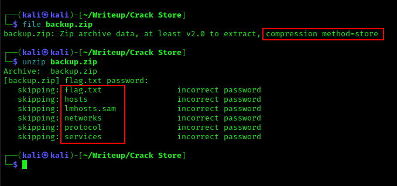
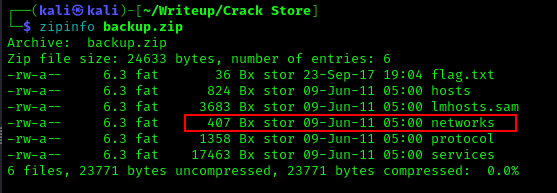
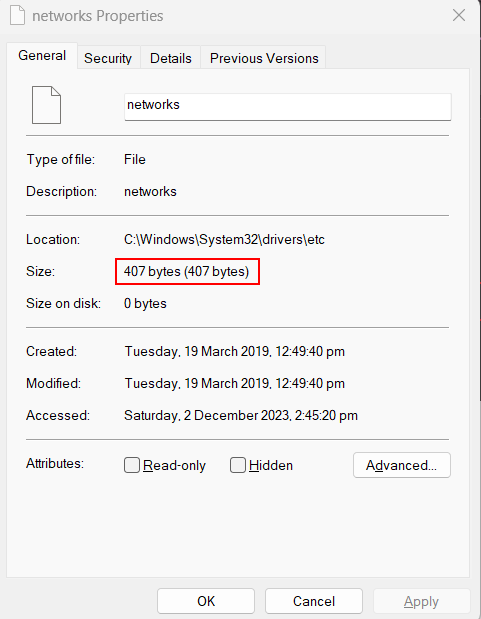
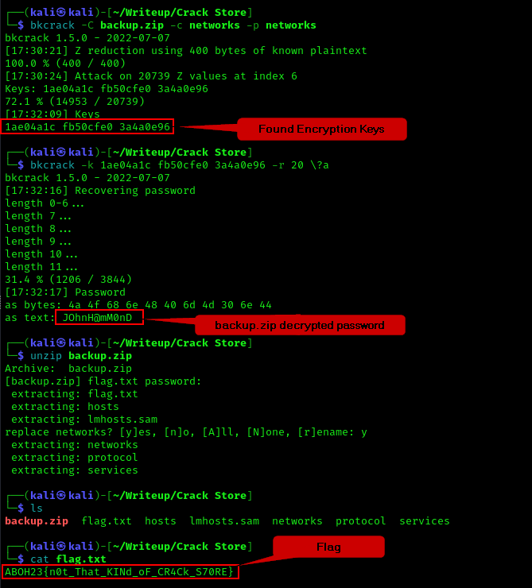

# Crack Store

## Summary
Crack Store challenges you to perform a known-plaintext attack on a Zip File using the **Store** compression method.

## Challenge Description
If I recall correctly, the challenge's description is about being tasked to find the password to unlock the file containing the backup files of a "Windows Server".

## File Analysis

<br>

The challenge file is a ZIP file named [backup.zip](backup.zip) which uses the "Store" compression method and when we try to unzip, prompts us a password. Using any random and wrong password shows that the ZIP file does not hide the filenames of its contents. As shown in the red box above, the ZIP file has usual contents in a Windows System's **C:\Windows\System32\drivers\etc** directory. This directory is the Windows equivalent to a Linux system's /etc directory.
<br>

Initially, from the challenge name, I thought the challenge creator required us to perform a dictionary attack using zip2john and john. However, I was wrong. So, I asked for a hint from the challenge creator and funny enough, he said the name of the challenge is the hint. Oh how dumb I felt...Googling ZIP Store Crack gives us an [article by acceis](https://www.acceis.fr/cracking-encrypted-archives-pkzip-zip-zipcrypto-winzip-zip-aes-7-zip-rar/) about cracking encrypted archives. Naisu.
<br>

The article mentions that the ZipCryto Store compression method can be cracked using the Biham and Kocher plaintext attack. The attacker has to know what the contents of the ZIP file should have in order for the attack to be successful.
<br>
<br>


<br>
Since we know the flag begins with "ABOH23{" I thought we could crack it, but it is not enough to perform the Biham and Kocher plaintext attack.
<br>
<br>


<br>
Then, I had a lightbulb, I remembered that the ZIP file has a default "networks" file with 407 bytes. Checking the networks file on my Windows machine shows that the file size is also 407 bytes. Now, I can use this networks file as the plaintext component to perform the plaintext attack!
<br>
<br>


<br>

By using [bkcrack](https://github.com/kimci86/bkcrack) and the following commands:
```bash
bkcrack -C backup.zip -c networks -p networks
# -C flag points to the compressed ZIP file.
# -c flag points to the "networks" file in the compressed ZIP file.
# -p flag points to the plaintext file. For this example, I copied my Windows networks file to my Kali machine with the same name.

bkcrack -k <encryption keys> -r <Max estimated length of password> \?a
# \?a tells bkcrack that the password can be any ASCII character.
```

<br>

Voila! The password turns out to be **JOhnH@mM0nD** and when used to unzip the file extracts all the file contents. Finally, we found the flag to be **ABOH23{n0t_That_KINd_oF_CR4Ck_S70RE}**
