# Fur Elise

## Summary
This challenge requires the challenger to deobfuscate malicious VBA and PowerShell Scripts and open Pastebin links that show the first and second halves of the flag.

## VBA Script
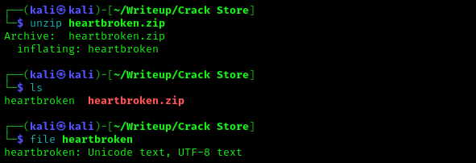
<br>
In the beginning of the challenge, we receive a ZIP file named [heartbroken.zip](heartbroken.zip) with no password protection. Unzipping this file gives a file without any extensions containing Unicode text in UTF-8 format.
<br>
<br>
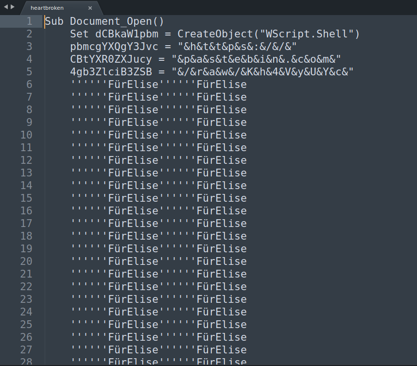
<br>
Opening this in Sublime Text shows that the file contains obfuscated VBA code.
<br>
<br>
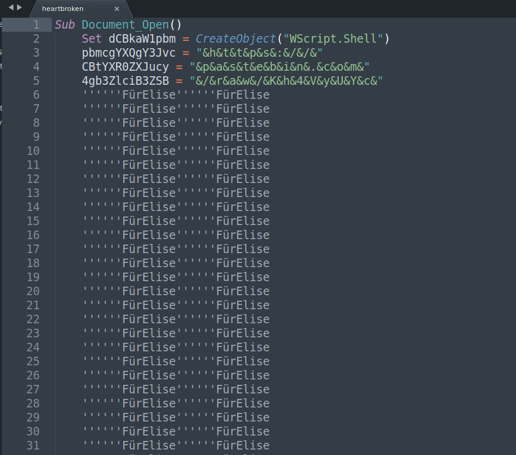
<br>
To make the code more readable and easier to deobfuscate, I change the Sublime Text’s syntax from Plain Text to ActionScript, a syntax that is relatively similar to VBA’s syntax.
<br>
<br>
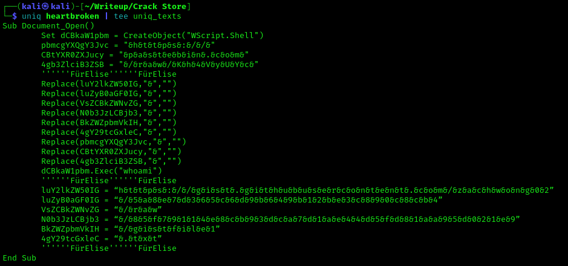
<br>
As the VBA script contains multiple duplicate lines mentioning FurElise. I used bash’s uniq command to give me only the important bits of the VBA script and pipe the output into a new created file named **uniq_texts** as shown above.
<br>
```bash
uniq heartbroken | tee uniq_texts
# The tee command just displays the output of the previous command onto the screen.
# Alternatively, you can use the following command if you do not want to see the output.
uniq heartbroken > uniq_texts
```
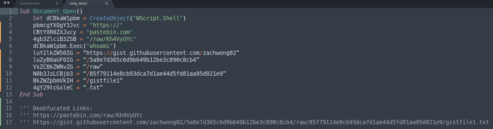
<br>
After deleting the ‘&’ character in the right-hand side of the variable declarations, the VBA is read as shown above. We see that there are two links, one that leads to a pastebin.com and another to the challenge creator’s github.
<br>
<br>
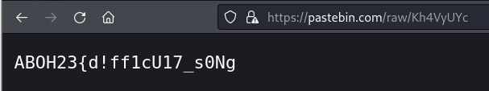
<br>
The pastebin link reveals the first half of the flag.

## PowerShell Script
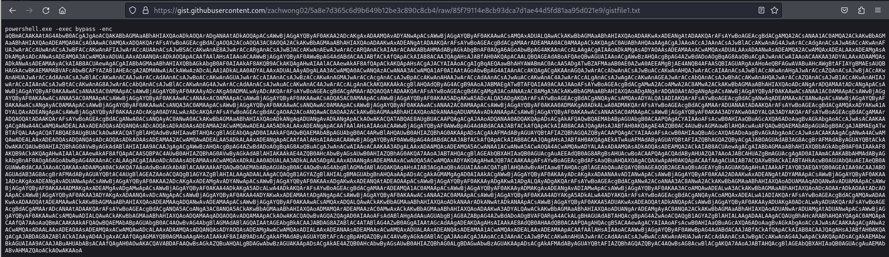
<br>
The second link leads to a powershell command. We notice that this command uses a Base64 encoding, as shown by the -enc flag, to prevent from being detected by AntiVirus software.
<br>
<br>
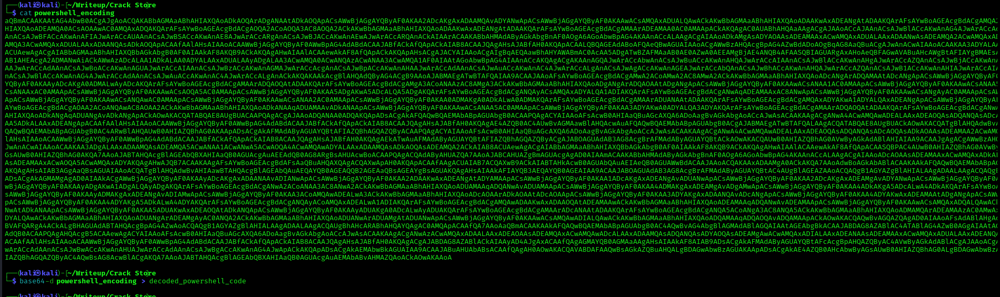
<br>
Next, I only took the Base64 payload and put it into a file named powershell_encoding and decoded the payload using Bash’s base64 command as shown above.
<br>
```bash
base64 -d powershell_encoding > decoded_powershell_code
```
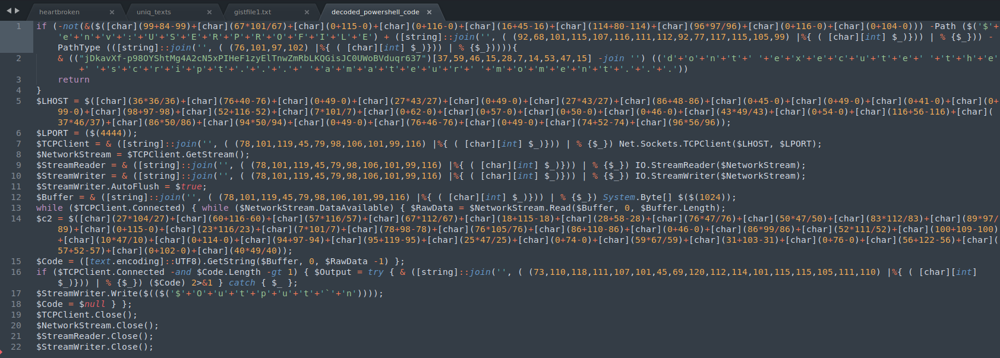
<br>
The decoded payload is as shown above (opened in Sublime Text using ActionScript syntax). Even though it is decoded, it is still obfuscated. To understand the code, we would have to deobfuscate the following lines:
```powershell
1. [char](99+84-99)+[char](67*101/67)+[char](0+115-0)+[char](0+116-0)+[char](16+45-16)+[char](114+80-114)+[char](96*97/96)+[char](0+116-0)+[char](0+104-0)
2. '$'+'e'+'n'+'v'+':'+'U'+'S'+'E'+'R'+'P'+'R'+'O'+'F'+'I'+'L'+'E'
3. [string]::join('', ( (92,68,101,115,107,116,111,112,92,77,117,115,105,99) |%{ ( [char][int] $_)})) | % {$_})
4. (([string]::join('', ( (76,101,97,102) |%{ ( [char][int] $_)})) | % {$_}))
5. ("jDkavXf-p98OYShtMg4A2cN5xPIHeF1zyElTnwZmRbLKQGisJC0UWoBVduqr637")[37,59,46,15,28,7,14,53,47,15] -join '')
6. ('d'+'o'+'n'+'t'+' '+'e'+'x'+'e'+'c'+'u'+'t'+'e'+' '+'t'+'h'+'e'+' '+'s'+'c'+'r'+'i'+'p'+'t'+'.'+'.'+'.'+' '+'a'+'m'+'a'+'t'+'e'+'u'+'r'+' '+'m'+'o'+'m'+'e'+'n'+'t'+'.'+'.'+'.')
7. [char](36*36/36)+[char](76+40-76)+[char](0+49-0)+[char](27*43/27)+[char](0+49-0)+[char](27*43/27)+[char](86+48-86)+[char](0+45-0)+[char](0+49-0)+[char](0+41-0)+[char](0+99-0)+[char](98+97-98)+[char](52+116-52)+[char](7*101/7)+[char](0+62-0)+[char](0+57-0)+[char](0+50-0)+[char](0+46-0)+[char](43*49/43)+[char](0+54-0)+[char](116+56-116)+[char](37*46/37)+[char](86*50/86)+[char](94*50/94)+[char](0+49-0)+[char](76+46-76)+[char](0+49-0)+[char](74+52-74)+[char](96*56/96)
8. [string]::join('', ( (78,101,119,45,79,98,106,101,99,116) |%{ ( [char][int] $_)})) | % {$_}
9. [string]::join('', ( (78,101,119,45,79,98,106,101,99,116) |%{ ( [char][int] $_)})) | % {$_}
10. [string]::join('', ( (78,101,119,45,79,98,106,101,99,116) |%{ ( [char][int] $_)})) | % {$_}
11. [string]::join('', ( (78,101,119,45,79,98,106,101,99,116) |%{ ( [char][int] $_)})) | % {$_}
12. [char](27*104/27)+[char](60+116-60)+[char](57*116/57)+[char](67*112/67)+[char](18+115-18)+[char](28+58-28)+[char](76*47/76)+[char](50*47/50)+[char](83*112/83)+[char](89*97/89)+[char](0+115-0)+[char](23*116/23)+[char](7*101/7)+[char](78+98-78)+[char](76*105/76)+[char](86+110-86)+[char](0+46-0)+[char](86*99/86)+[char](52*111/52)+[char](100+109-100)+[char](10*47/10)+[char](0+114-0)+[char](94+97-94)+[char](95+119-95)+[char](25*47/25)+[char](0+74-0)+[char](59*67/59)+[char](31+103-31)+[char](0+76-0)+[char](56+122-56)+[char](57+52-57)+[char](0+102-0)+[char](40*49/40)
13. [string]::join('', ( (73,110,118,111,107,101,45,69,120,112,114,101,115,115,105,111,110) |%{ ( [char][int] $_)})) | % {$_}
14. '$'+'O'+'u'+'t'+'p'+'u'+'t'+'`'+'n'
```
For deobfuscating challenges such as this, I usually open the Sublime Text side by side with a terminal in Python’s interactive mode. This helps me to convert the integers into ASCII characters fast and evaluate the arithmetic equations fast. What I do to make this process faster is to use Sublime Text’s replace feature using the following RegEx to give me the relevant integers.
<br>
```bash
(\[char\]\([0-9]{1,3}\+)|(\[char\]\([0-9]{1,3}\*)|\-[0-9]{1,3}\)|\/[0-9]{1,3}\)
```
Replacing the output from the RegEx above with a comma character allows me to convert the values to ASCII characters easier using the following [Python script](ascii-fier.py) I created for this challenge.
<br>
```python
#!/bin/python
import sys

def convert(a):
        b = []
        for i in a:
                b.append(chr(i))

        return b

# Change the value of array here.
if (len(sys.argv) < 2):
        print("usage ./ascii-fier.py <string containing numbers seperated by commas>")
        print("Example: ./ascii-fier.py 45,67,29,117")
        sys.exit()
usr = sys.argv[1]
arr = [i for i in map(int, usr.split(','))]
print(f"Output: {''.join(convert(arr))}")
```
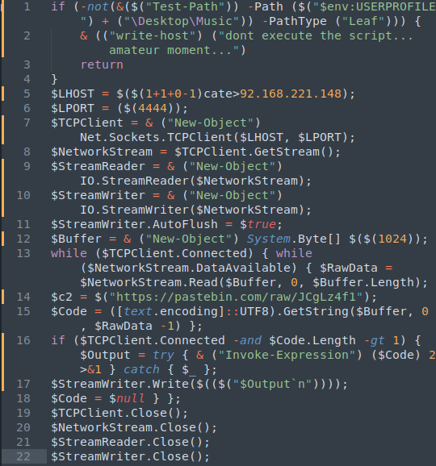
<br>
Specific steps to deobfuscate the other commands can be found in the [deobfuscated_powershell_code.txt](deobfuscated_powershell_code.txt) file. The deobfuscated PowerShell script should look as shown above. Naisu, it gives us another pastebin link.
<br>
<br>
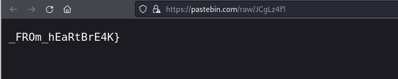
<br>
Opening the pastebin link shows us the second half of the flag which when combined with the first half gives **ABOH23{d!ff1cU17_s0Ng_FROm_hEaRtBrE4K}**.
