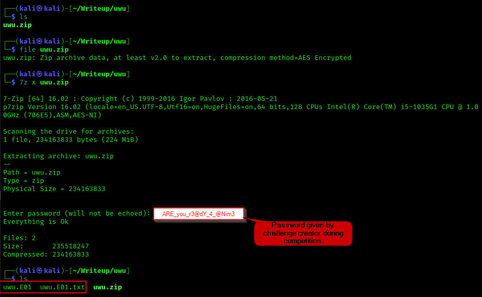

# uwu

## Summary
This challenge is about investigating how did the computer of a Naruto fanatic got infected with malware by using Autopsy for file analysis and Hybrid-Analysis for Automated Malware Analysis.

## File Analysis

<br>

This challenge gives a file named [uwu.zip](https://www.dropbox.com/scl/fi/llg2xex88d20oxbbq79b7/uwu.zip?rlkey=td9mmad9dff8bc968ghl9kqp5&dl=0) (Had to use Dropbox due to file being too big for Github). We are provided with the password to the ZIP file by the challenge creators during the competition, **ARE_you_r3@dY_4_@Nim3**.
<br>

```bash
7z x uwu.zip
```


<br>

7zip is required to extract the contents of the ZIP file using the provided password as shown above. It is shown that we are provided with an E01 image file and .txt file. The .E01 file can be opened using FTK Imager or Autopsy, while the .txt file only provides image's MD5 and SHA1 checksums so that we can ensure the evidence is not tampered once we finish the analysis. However, not important in finding the flag.

<br>


<br>
To analyse the .E01 image file, we can use autopsy which comes installed in Kali. The following command can be used to open Autopsy which will give us a localhost link to open autopsy in any web browser as shown above.

```bash
sudo autopsy
```

<br>
Analysing the image file, we found that the mp4 filenames downloaded by the victim have been encoded into Base64. Additionally, we found a credentials.txt file with the following contents:

```bash
naruto:dattebayo
hinata:iloveyou
itachi:shisui
jiraiya:tsunade
```

<br>


<br>

However, the juiciest parts in the image file are the **private.rar** and **kotoamatsukami.exe** files.

## private.rar
Using unrar to extract the contents of the file prompts us a password. From the credentials.txt file, we found that the victim's password is **dattebayo** and using that enables us to extract the contents of the RAR file successfully. However, only more videos of Naruto with a Base64 encoded filename were found...Nothing useful.
<br>

## kotoamatsukami.exe
At this point, I was running around in circles and did not manage to analyse the .exe flag in time and submit the flag. The challenge creator hinted to use ProcMon to analyse the executable. Seeing that I did not have a Windows VM installed for the competition, I tried to find an alternative but ran out of time. Additionally, DO NOT EXECUTE THIS FILE IN YOUR HOST MACHINE. I learned it the hard way... :')

<br>

I knew this part required some Malware Analysis skills on a Windows VM and cannot be performed on a Linux machine...But the John Hammond in me said NO! and kept finding an alternative to which I remembered a wise quote I got from a coworker during my internship:

<br>

*"Why you doing manually and making your life hard when you can automate the stuff"*

<br>


<br>


"Automate"...I quickly looked up online for sites that offer automated malware analysis services such as Cuckoo Sandbox and Joe Sandbox Cloud, however, they require a profile and aren't free. But, Hybrid Analysis is free and does not require a profile. I uploaded the malware sample in Hybrid Analysis and analysed the behaviour of the malware. To hasten the CTF process, I just searched for "strings" produced by the malware and lo and behold, I found a HTTP request to the challenge creator's GitHub. 
<br>
<br>


<br>

Jackpot! Now, I just need to get the Description metadata of a file named **genjutsu.jpg** and form the string using the indexes shown in the PowerShell code above. We can find the Description metadata by doing the following:

```bash
exiftool genjutsu.jpg | grep Description

# Description is "ABCDEFGHIJKLMNOPQRSTUVWXYZabcdefghijklmnopqrstuvwxyz0123456789!_@{}"
```

<br>

The following Python code is then used to find the flag:

```python
desc = "ABCDEFGHIJKLMNOPQRSTUVWXYZabcdefghijklmnopqrstuvwxyz0123456789!_@{}"

arr = [desc[0], desc[1], desc[14], desc[7], desc[54], desc[55], desc[65], desc[41], desc[4], desc[17], desc[57], desc[62] desc[18], desc[45], desc[55], desc[13], desc[2], desc[4],  desc[63],  desc[62], desc[57], desc[63], desc[38],  desc[50], desc[63], desc[39],  desc[34], desc[39], desc[35], desc[64], desc[63], desc[48], desc[26], desc[24], desc[66]]

print("".join(arr))

```

The flag is found to be **ABOH23{pER5!St3NCE_!5_my_ninj@_waY}**
